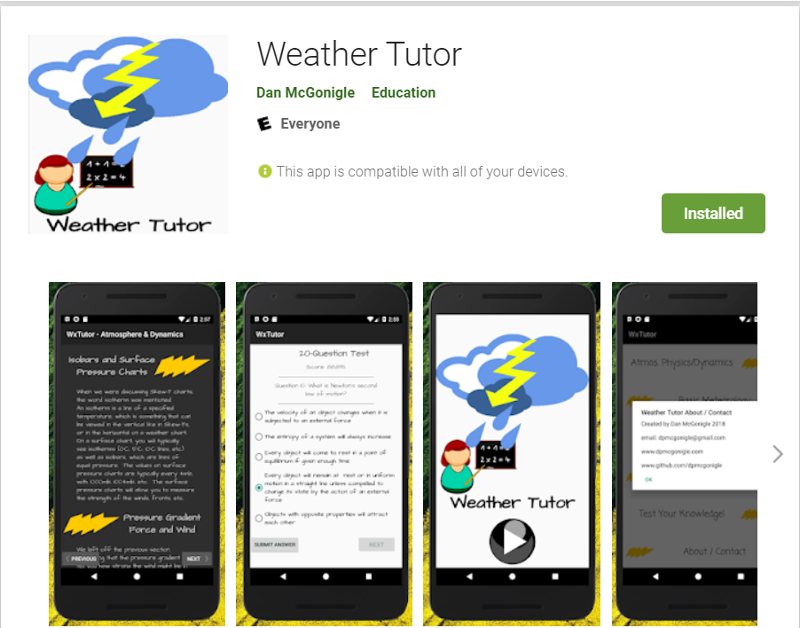

# WxTutor

## About

### A Java Android App developed in Android Studio for learning basic meteorology.

This is an App that will discuss the basic physics, dynamics, and meteorological concepts to understand complex weather phenomena. This program discusses qualitative aspects to weather, leaving the intense math and physics aside and laying out the fundamental aspects to our dynamic atmosphere. Along with educational content, there is a module to help the user understand conversion from one unit of measure to several others, as operational meteorology often requires an understanding of more than just the metric system. Lastly, there is a 20-question comprehensive test with a test bank of more than 75 questions that the user can take and re-take for rapid-fire learning.

### Built with 12 years of meteorology experience!

To include several years of teaching meteorology in the U.S. Air Force.

## Code

### File structure

The *.java files can be found here -> WxTutor/app/src/main/java/mcgonigleapps/wxtutor/

The layout files can be found here -> WxTutor/app/src/main/res/layout/

The manifest file can be found here ->  WxTutor/app/src/main/

### Built in Android Studio

I drew heavily from knowledge learned from 'Android Programming: The Big Nerd Ranch Guide', and I would highly recommend this book to anyone interested in learning the basics of developing Android Apps in Java.

## Authors

* **Dan McGonigle** [dpmcgonigle](https://github.com/dpmcgonigle)
